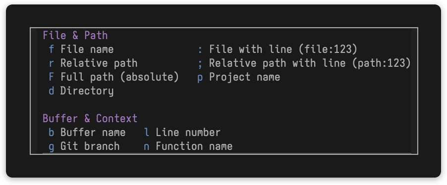

<div align="center">
  

# context-clues

<a href="https://melpa.org/#/context-clues"></a>
<a href="https://stable.melpa.org/#/context-clues"></a>
<a href="https://github.com/mrcnski/context-clues/actions/workflows/ci.yml"></a>
<a href="LICENSE"></a>


Easily copy context like the current file name and path, using a convenient transient menu interface!


</div>

## Features

context-clues lets you copy various file, buffer, and code context information
to the kill ring.  Useful for e.g. communicating context with LLMs.

Every entry in the menu shows a **live preview** of the value it would copy —
labels on the left, values on the right. Entries that don't apply to the
current buffer are grayed out.

- **File name** - Copy base file name (e.g., `file.el`)
- **Relative path** - Copy relative path from project root (e.g., `src/lib/file.el`)
- **Full path** - Copy absolute file path
- **Directory** - Copy directory path (or default directory for non-file buffers)
- **File with line** - Copy file name with line number (e.g., `file.el:123`)
- **Breadcrumb** - Copy relative path plus the context at point
- ... and more!

## Installation

### MELPA

context-clues is available on [MELPA](https://melpa.org/#/context-clues):

```
M-x package-install RET context-clues RET
```

Or with use-package:

```elisp
(use-package context-clues
  :ensure t
  :bind ("C-c c" . context-clues))
```

### Manual Installation

1. Clone or download this repository:

```bash
git clone https://github.com/mrcnski/context-clues.git ~/.emacs.d/packages/context-clues
```

2. Add to your Emacs configuration:

```elisp
(add-to-list 'load-path "~/.emacs.d/packages/context-clues")
(require 'context-clues)
```

Or with use-package:

```elisp
(use-package context-clues
  :load-path "~/.emacs.d/packages/context-clues"
  :bind ("C-c c" . context-clues))
```

## Usage

Run `M-x context-clues` to open the transient menu, then press the corresponding key to copy:

- `f` - Copy file name
- `F` - Copy full path (absolute)
- `d` - Copy directory
- etc.

## Customization

### Message Format

Customize the message shown after copying:

```elisp
(setq context-clues-message-format "Copied: {text} ({description})")
```

Use `{text}` for the copied text and `{description}` for the description (e.g., "file name"). You can reorder them as needed:

```elisp
;; Show description first
(setq context-clues-message-format "{description}: {text}")
```

### Previews

Long values are truncated at the front (keeping the tail — for paths, the
distinctive part). Customize the width and the face:

```elisp
(setq context-clues-preview-max-width 60) ; default 50
```

The previews use the `context-clues-preview-face` face (inherits `shadow` by
default); customize it with `M-x customize-face`.

### Breadcrumb Separator

Customize the separator between breadcrumb components:

```elisp
(setq context-clues-breadcrumb-separator " » ") ; default " > "
```

### Key Binding

Bind to a convenient key:

```elisp
(global-set-key (kbd "C-c c") 'context-clues)
```

## Requirements

- Emacs 28.1 or later

## License

GPL-3.0-or-later
